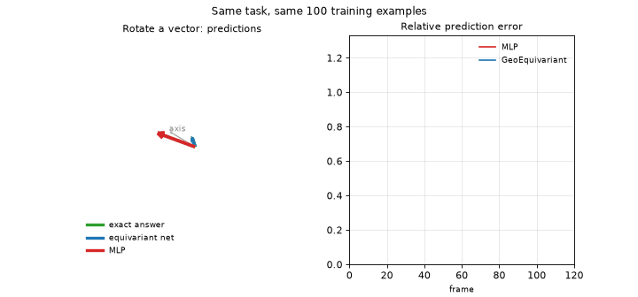

# Geometric Algebra Layers vs Scalarization for SO(3)-Equivariant Vector Laws

This project measures whether Cl(3,0) geometric algebra layers bring anything
beyond exact SO(3) equivariance on small synthetic 3D vector tasks.

Short answer: not on single-product laws, where a trivial scalarization baseline
matches or beats them, but yes on composed rotations, where stacked geometric
products beat every baseline tested. No model extrapolates invariant magnitudes
(angle, radius, separation). See `RESULTS.md` for the tables and `paper/` for the arXiv draft.

ArXiv paper : https://arxiv.org/abs/2607.06634

## In plain words

Many physical quantities follow the rotation of their frame: turn the scene,
the force turns with it. A neural network can be built so that this rule holds
exactly instead of being learned from examples, and such networks need far
less data. There are two ways to build one. The simple way combines the input
vectors with learned weights that depend only on lengths and angles between
them. The sophisticated way, geometric algebra, gives the network a native
notion of rotation it can multiply and chain. This project measures when the
sophisticated way is actually worth it. Answer: almost never on simple laws,
where the simple way is as accurate and 15x faster to train, but clearly on
laws that chain rotations together, where the native rotation operation wins
with 17x fewer parameters. And a warning that applies to both: neither method
predicts anything sensible beyond the magnitudes seen in training. Bigger
angles, larger distances, all bets are off.

Where this shows up in practice:

- Robotics: a gripper senses a force in its own frame; the controller needs
  that force, and the resulting torque, in the world frame. This is exactly
  our torque task, and the regime where geometric algebra layers pay off.
- Physics and chemistry simulation: forces between particles, molecular
  dynamics, interatomic potentials. Our central force and two-body tasks are
  the toy versions; the simple method is enough there.
- Drones and IMUs: composing orientation estimates over time is a chain of
  rotations, the other case where the native rotation operation wins.
- Graphics and animation: skeleton joints compose rotations along a limb.

And the warning matters in practice too: a model trained on gentle motions
will not predict violent ones, whatever its architecture. Symmetry buys
generalization across directions, never across magnitudes.

## Demo



Two networks, same task, same 100 training examples: rotate a vector by a
given axis and angle. The plain MLP (red) is wrong as soon as the rotation
leaves the neighborhood of its training data. The equivariant network (blue)
tracks the exact answer (green, hidden underneath) for every orientation,
because the symmetry is built into its weights instead of learned from
examples. Reproduce with `python demo/demo.py`.

## Layout

| File | Content |
|---|---|
| `geonet_lib.py` | Cl(3,0) layers, MLP, original three tasks, training loop |
| `geonet_ext.py` | Scalarization baseline, compositional tasks, NMSE, timing |
| `run_benchmarks.py` | Raw-MSE benchmark runner; `run_audit.py` is the NMSE version used for the results |
| `run_audit.py` | Main runner: 5 seeds, NMSE, per-seed scores, resume support |
| `tune_check.py` | lr x epochs grid for MLP and scalarization |
| `scalarization_control.py` | Strengthened scalarization on composed rotations |
| `run_curves.py` | Sample-efficiency curves (supports --device cuda) |
| `run_ablations.py` | Depth vs chain length, EquiNorm/GradeGate, multiplicative control, nested cross |
| `robotics_control.py` | Strengthened scalarization on local-to-world robotics tasks |
| `ROBOTICS_RESULTS.md` | Results for local force and rotated-force torque tasks |
| `tests/test_sanity.py` | Equivariance and task correctness checks |
| `demo/demo.py` | Animated demo comparing MLP and equivariant predictions |
| `results/` | All result JSONs, committed for reproducibility |
| `paper/` | arXiv draft: main.tex, references.bib, figure generation |

## Requirements

Python 3.10 or later and PyTorch (CPU is enough). No other dependency.

```bash
pip install torch --index-url https://download.pytorch.org/whl/cpu
```

## Run

```bash
python tests/test_sanity.py         # sanity checks, about a minute
python run_audit.py                 # main benchmark, 5 seeds, writes results/audit_5seeds.json
python tune_check.py                # tuning control
python scalarization_control.py     # scalarization fairness control
python robotics_control.py          # robotics scalarization control
python run_ablations.py             # depth, EquiNorm/GradeGate, multiplicative, nested cross
python run_curves.py                # sample-efficiency curves (add --device cuda if available)
python paper/make_figures.py        # regenerate the paper figures from results/
```

The main benchmark takes about an hour on 4 CPU cores. It writes incrementally
and resumes if interrupted.

## Tasks

- `rotation`: (axis*angle, p) -> R p. OOD on unseen axis hemisphere and unseen angle range.
- `cross`: (a, b) -> a x b. OOD on unseen hemisphere.
- `central_force`: (r, distractor) -> -r/(|r|^3+0.05). OOD on unseen radii.
- `two_body`: (r1, r2) -> force between two points. OOD on unseen separations.
- `compose_rotation`: (u1, u2, p) -> R(u2) R(u1) p. OOD on unseen axis hemispheres.
- `torque_rotated_force`: (lever, orientation, local force) -> world torque.
- `local_force`: identical to `rotation` under a robotics framing, kept for
  completeness, counts as no additional evidence (see `ROBOTICS_RESULTS.md`).
- `nested_cross`: (a, b, c) -> a x (b x c). Composition without rotations,
  flattens into polynomial coefficients, won by scalarization.
- `chain_1` to `chain_4`: p -> R_L ... R_1 p, used by the depth ablation.

## Models

- `MLP`, `MLP-Aug` (SO(3) augmentation x8): non-equivariant references.
- `Scalarization`: dot products -> MLP -> coefficients on {v_i, v_i x v_j}. Exactly equivariant.
- `VN`, `VN-Cross`: Vector Neurons (Deng et al. 2021), faithful and with cross
  product channels. External equivariant baseline.
- `E3NN`: irreducible-representation tensor-product network (e3nn). Second
  external equivariant baseline, optional dependency.
- `GeoBilinear`: geometric products without equivariant tying. Ablation control.
- `GeoEquivariant`: grade-wise tied Cl(3,0) bilinear network. Exactly equivariant.

## Metric

NMSE: test MSE divided by the MSE of the constant mean predictor on the test set.
1.0 equals trivial. Raw MSE is misleading on the OOD radius splits because
far-field targets are small.

## License

MIT.

## Star history

[](https://star-history.com/#infinition/ga-vs-scalarization&Date)
